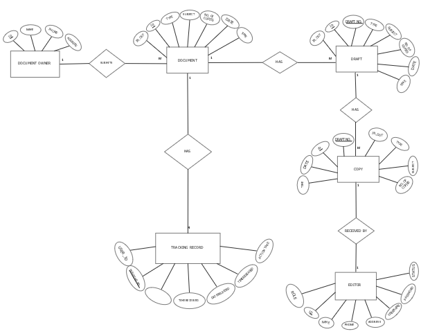

## Documents-Control-System
The system needs to track documents.  

<h2>A Python microservice connects to MySQL DB using Flask Framework and have the following endpoints:</h2>
a- an endpoint to add new customer.
b- an endpoint to update customer.
c- an endpoint to delete customer.
e- an endpoint to get customer.

## ERD Diagram of the system 
  

